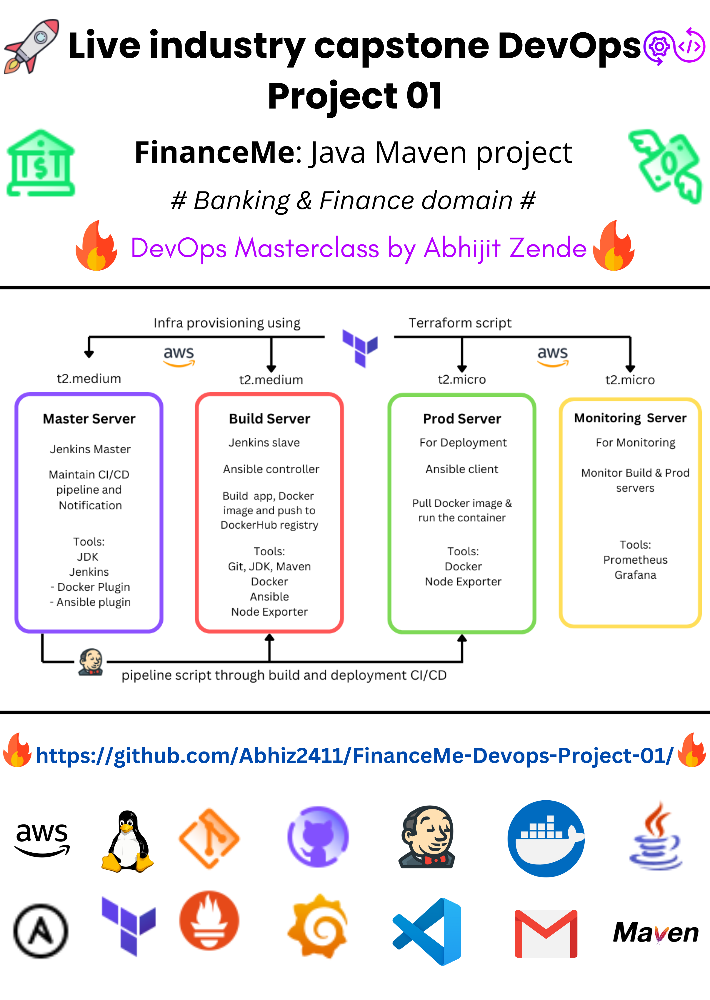
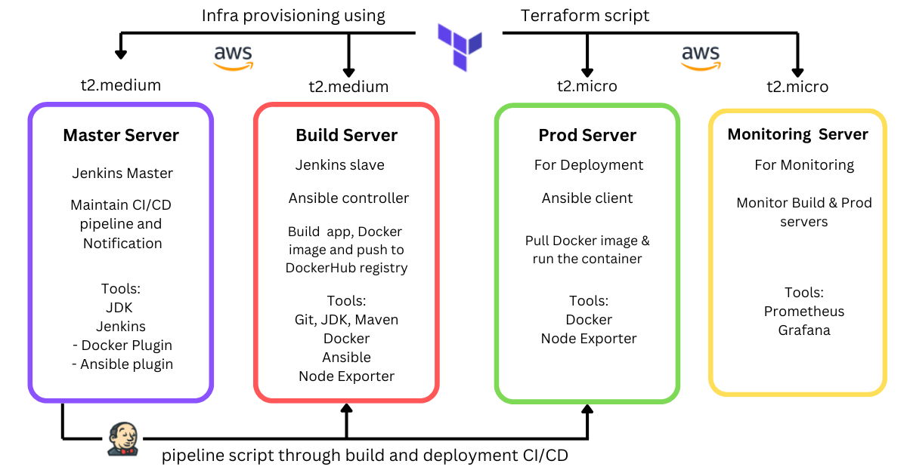
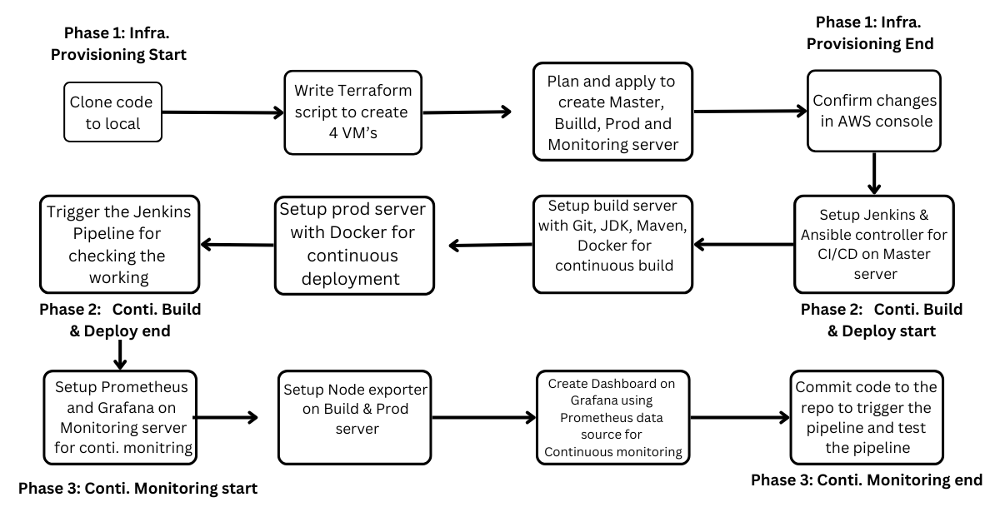

# FinanceMe DevOps Project 01 🚀

This project demonstrates the deployment of a DevOps pipeline for a global banking and financial services provider, **FinanceMe**. The company transitioned from a monolithic architecture to a microservice-based architecture to handle increased traffic and scaling challenges. The project involves automating infrastructure provisioning, build and deployment processes, and continuous monitoring using modern DevOps tools and AWS services.

## Tools Used 🛠️
- **AWS** (EC2, Security Groups, Access Tokens, etc.)
- **Linux**
- **Python**
- **Git** & **GitHub**
- **VS Code** & **MobaXterm**
- **Jenkins** for CI/CD pipelines
- **Docker** & **DockerHub** for containerization
- **Ansible** for automation
- **Terraform** for infrastructure provisioning
- **Prometheus** & **Grafana** for monitoring
- **Node Exporter** for server metrics

## Project Phases 📊
The project is divided into three main phases:

### 1️⃣ **Automating Infrastructure Provisioning**
- **Terraform** is used to create 4 AWS EC2 instances:
  - **Jenkins Master Node** (for CI/CD pipeline management)
  - **Build Server** (for application and Docker image builds)
  - **Production Server** (for deploying Dockerized applications)
  - **Monitoring Server** (for continuous monitoring of Build and Prod servers)

### 2️⃣ **Automating Build and Deployment**
- **Jenkins** is configured for a CI/CD pipeline:
  - Jenkins Master Node is responsible for pipeline orchestration.
  - Build Server is configured as a Jenkins Slave Node to handle application builds and Docker image creation.
  - **Ansible** is used for automating deployment to the Prod server, where the application is deployed using an Ansible client-server model.

### 3️⃣ **Continuous Monitoring**
- **Prometheus** and **Grafana** are used for real-time monitoring:
  - **Node Exporter** is installed on both Build and Prod servers to collect server metrics (CPU, Disk Space, Memory Utilization).
  - **Grafana Dashboard** is created to visualize these metrics for continuous monitoring.

## Features 🌟
- **Automated Infrastructure Setup:** Provision AWS resources using Terraform.
- **CI/CD Pipeline:** Jenkins automates the build, test, and deployment process.
- **Containerized Deployment:** Docker is used to containerize the application and deploy it efficiently.
- **Ansible Automation:** Deploy applications using Ansible's push mechanism for automated production deployment.
- **Real-time Monitoring:** Prometheus and Grafana provide continuous insights into the system’s performance.

## How to Set Up 📋
### Prerequisites:
- **AWS Account** with access to EC2, Security Groups, and IAM roles
- **Terraform** installed for provisioning infrastructure
- **Docker** installed for containerizing applications
- **Jenkins** installed for CI/CD pipeline setup
- **Ansible** installed for deployment automation
- **Prometheus** and **Grafana** set up for monitoring

## Project Architecture 🏗️
- **Terraform** creates the infrastructure on AWS.
- **Jenkins** handles the CI/CD process for building and deploying Docker images.
- **Ansible** automates the deployment process to the Prod server.
- **Prometheus** and **Grafana** monitor the system and provide performance insights.

## Contributing 🤝
- Fork the repository
- Create a new branch (`git checkout -b feature-name`)
- Commit your changes (`git commit -am 'Add new feature'`)
- Push to the branch (`git push origin feature-name`)
- Create a new Pull Request

## Contact 📬
For any queries or issues, feel free to reach out to me at:  
**Email**: [mosratisayf20@gmail.com](mailto:mosratisayf20@gmail.com)  
**LinkedIn**: [Mosrati-Saifeddine](https://www.linkedin.com/in/saifeddine-mosrati-60436b2bb/)
**Portfolio website**: [Mosrati Saifeddine]()

---

Happy coding! 😎🚀
